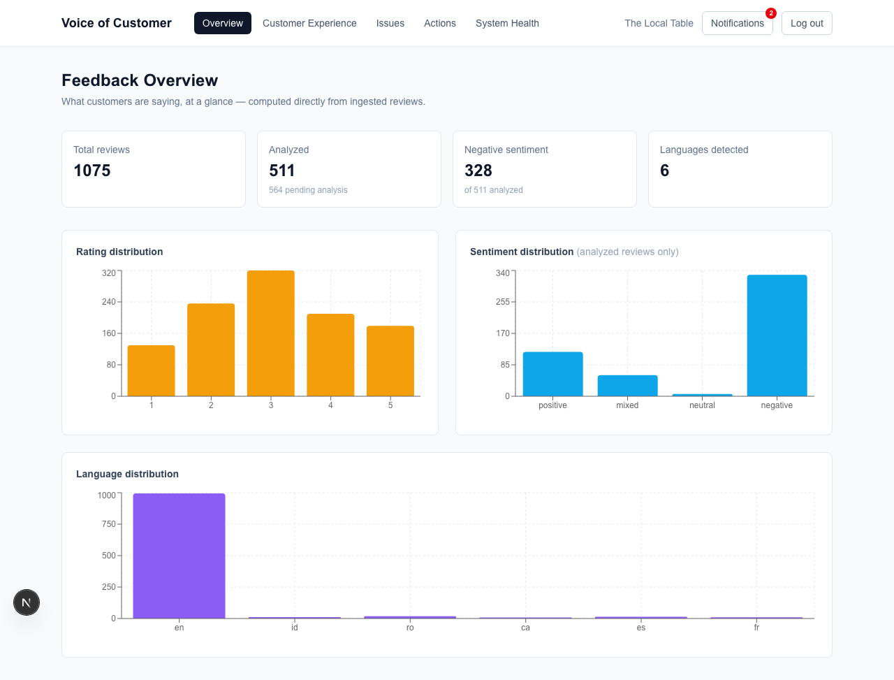
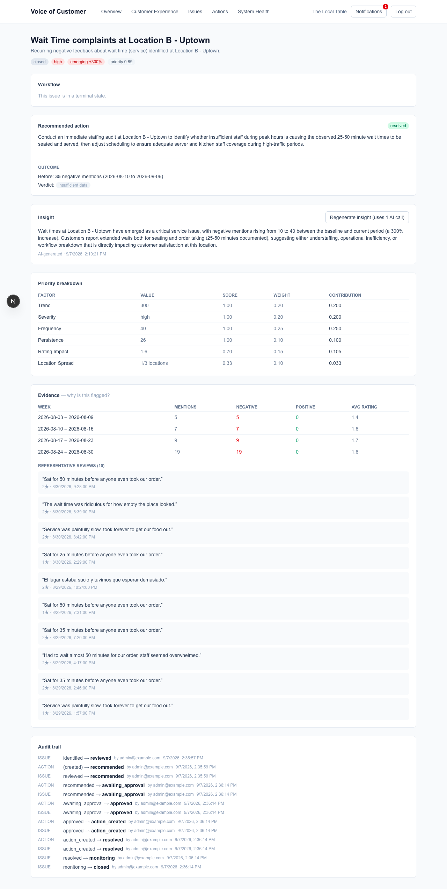
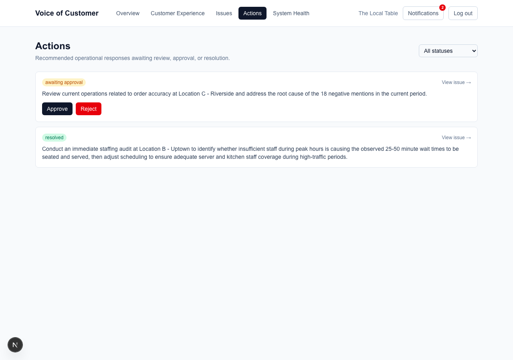

# Review Manager — Voice of Customer

A feedback-to-action system for a multi-location restaurant business: customer reviews
are AI-classified, rolled up into recurring operational issues, prioritized, explained
with a grounded evidence-backed insight, turned into a recommended action, held for
human approval, and tracked for whether the underlying problem actually improved
afterward.

## Why this exists

Most "AI review analysis" stops at `review → sentiment label`. That's not the same
problem as `review → recurring operational problem → prioritized insight → approved
action → measurable outcome` — the actual gap between individual feedback and something
a restaurant operator can act on. A single 1-star review about a slow table isn't
information; forty of them at one location over three weeks, ranked against every other
issue in the business, explained in plain language, and turned into an approved
staffing-audit task is. This project treats that whole chain as the product, not just
the classification step at the front of it.

## Status

| Capability | Status |
|---|---|
| Review ingestion (single + batch, idempotent dedup, language detection) | ✅ Complete — tested |
| AI review analysis (sentiment, topic, aspect, severity via Claude) | ✅ Complete — tested; quality verified against 48 hand-labeled examples (see [Evaluation](#evaluation)) |
| Deterministic aggregation (weekly rollups) | ✅ Complete — tested |
| Recurring-issue detection (taxonomy-based, deterministic) | ✅ Complete — tested |
| Trend detection + explainable priority scoring | ✅ Complete — tested |
| Grounded insight generation (Claude, evidence-constrained) | ✅ Complete — tested; live-verified with a real Claude call |
| Recommended actions + human approval workflow | ✅ Complete — tested; live-verified with a real Claude call |
| Outcome monitoring (before/after verdict) | ✅ Complete — tested |
| Dashboard (Next.js, 7 views) | ✅ Complete — verified live in a browser against the real backend |
| Scheduled-job orchestration + in-app notifications | ✅ Complete — tested; pipeline script verified live against Docker |
| Deterministic test suite | ✅ 75/75 passing |
| RBAC / multi-tenant auth | ⛔ Deliberately not implemented (single-admin JWT — see [Engineering decisions](#engineering-decisions)) |
| Live cloud deployment | ⏸️ Not deployed — deployment hardening is documented in [DEPLOYMENT.md](DEPLOYMENT.md), actual provisioning is a planned next step |

Every row above marked "tested" is covered by the automated suite (`pytest -q`, no API
key required). Rows marked "live-verified" additionally had a real Claude API call made
against them at least once during development, on top of the deterministic tests.

## How it works

```
Customer Feedback
      ↓
AI Analysis            (sentiment · topic · aspect · severity — Claude)
      ↓
Aggregation             (deterministic weekly rollup)
      ↓
Recurring Issue Detection   (deterministic taxonomy matching)
      ↓
Trend + Priority        (deterministic scoring)
      ↓
Grounded Insight         (Claude, constrained to a pre-computed evidence snapshot)
      ↓
Recommended Action       (Claude, same evidence-grounding)
      ↓
Human Approval           (required — nothing acts on a customer or operation alone)
      ↓
Outcome Monitoring       (deterministic before/after comparison)
```

**Central design principle: AI performs interpretation and judgment; deterministic code
performs control and execution.** Claude decides what a review is about and drafts the
explanatory language. It never touches a database write, a math calculation, a workflow
transition, or a decision about whether an action actually gets taken — see
[AI / ML components](#ai--ml-components) for the exact line.

## Architecture

| Component | Location | Role |
|---|---|---|
| API | `app/main.py` | FastAPI app — auth, CORS, and every router wired centrally |
| Ingestion | `app/ingestion/` | Validate → dedup (content-hash + source id) → persist, with per-item failure isolation |
| Analysis | `app/analysis/` | The only module allowed to call Claude for classification; retry/dead-letter, `AIInvocation` logging |
| Aggregation | `app/aggregation/` | Deterministic weekly rollups into `AggregatePeriodMetric` — no AI calls |
| Issues | `app/issues/` | Taxonomy-based recurring-issue promotion, trend detection, explainable priority scoring, evidence provenance |
| Insights | `app/insights/` | Grounded LLM insight synthesis from a pre-computed evidence snapshot, plus a secondary groundedness check |
| Actions | `app/actions/` | AI action recommendation, human approval workflow, outcome tracking |
| Workflow | `app/workflow/` | Shared state-machine validator + `WorkflowEvent` audit logging used by both issues and actions |
| Notifications | `app/notifications/` | Deterministic in-app notifications on specific business events |
| Observability | `app/observability/` | Sentry init, structured JSON logging, `/system-health` read API |
| Evaluation | `evaluation/` | Consolidated eval harness — AI-quality metrics + the deterministic-suite report |
| Persistence | `alembic/`, PostgreSQL, SQLAlchemy 2.0 | Every schema change is a hand-reviewed migration; enum additions are always explicit (Postgres enum autogenerate gotcha) |
| Dashboard | `frontend/` (Next.js 16, App Router, Tailwind, Recharts) | Client-only SPA — JWT in `localStorage`, no server session |
| CI | `.github/workflows/ci.yml` | Lint, migrate, test on every push — dummy credentials, no real secrets |
| Deployment (planned) | `render.yaml`, `Dockerfile` | Render (API + Postgres + cron) + Vercel (frontend) — see [DEPLOYMENT.md](DEPLOYMENT.md) |

## AI / ML components

| AI decides | Deterministic code decides |
|---|---|
| Overall review sentiment | Weekly aggregation math |
| Topic classification | Trend direction/magnitude |
| Aspect identification | Priority score and its breakdown |
| Aspect-level sentiment | What gets persisted, and when |
| Severity (low/medium/high) | Workflow state transitions |
| Which review text is cited as evidence | Whether an action is approved |
| The wording of a grounded insight | Whether/who gets notified |
| The wording of a recommended action | Outcome before/after calculation |

Claude is called in exactly two places (`app/analysis/claude_client.py`, reused by
`app/insights/` and `app/actions/`), always via forced tool-use against a Pydantic
schema — the model's raw output is never trusted, only validated. Insight and action
generation are additionally constrained to a pre-computed evidence object (real numbers,
real review quotes) rather than free-form synthesis from raw data, so a generated
sentence can't invent a statistic that isn't backed by an actual `AggregatePeriodMetric`
row. A secondary regex-based groundedness check runs on every insight as a non-blocking
safety net, logging (never blocking) if generated text mentions a number the evidence
doesn't support.

## Evaluation

**Deterministic test suite: 75/75 passing**, reproducible on every commit with zero API
cost (`pytest -q`) — covers ingestion, aggregation, issue detection, trend/priority,
workflow, outcomes, notifications, pipeline orchestration, and every API route.

**AI classification quality**, measured separately: `evaluation/ai_quality.py` runs the
real Claude analysis pipeline against 48 hand-labeled examples
(`data/synthetic/eval_labels.json`) and scores it against overall sentiment, aspect
recall, aspect-sentiment accuracy, and structured-output validity.

| Metric | Result |
|---|---|
| Overall sentiment accuracy | 100.0% |
| Aspect recall | 100.0% |
| Aspect-sentiment accuracy | 100.0% |
| Structured-output validity rate | 100.0% |
| Examples scored | 48 / 48 |
| Real Claude API calls made | 144 |

**This is a one-time historical result, not continuously re-run.** It cost real API
budget when it ran; `evaluation/generate_report.py` reads the committed
[`evaluation/EVAL_REPORT.md`](evaluation/EVAL_REPORT.md) artifact from that run rather
than calling Claude again, by design — see ADR-9 in [ARCHITECTURE.md](ARCHITECTURE.md)
for why evaluation is built incrementally per capability rather than as one continuous
live pipeline.

## Observability

Two independent audit trails answer two different questions, and they are deliberately
never merged:

- **`AIInvocation` — AI call history.** Every Claude call (model, prompt version,
  latency, token counts, whether structured-output validation passed) regardless of
  which business object it was for.
- **`WorkflowEvent` — business-object lifecycle history.** Every `Issue`/`Action` state
  transition (from-state, to-state, actor, reason, timestamp), regardless of whether AI
  was involved in producing it.

On top of those: `ProcessingRun` records one row per pipeline execution (aggregate,
issue-detection, trend, insight, outcome, analyze), visible in the dashboard's System
Health view; structured JSON logs go to stdout for every request; Sentry is wired in and
fully opt-in — a missing `SENTRY_DSN` is a normal, supported local-dev state, not a
degraded one.

## Dashboard

A Next.js SPA, JWT-authenticated, consuming the FastAPI backend directly.

| View | Question it answers |
|---|---|
| Overview | What's happening across all the feedback we've received? |
| Customer Experience | What are customers actually saying, by specific aspect? |
| Issues | Which recurring problems matter most right now? |
| Issue Detail | Why does this issue matter — what's the evidence, the insight, the full history? |
| Actions | What are we doing about it, and what's still waiting on a human? |
| System Health | Is the automation itself working? |
| Notifications | What changed since I last looked? |

**Overview** — review volume, rating/sentiment/language distributions, computed directly
from ingested and analyzed reviews:



**Issue Detail** — the full evidence chain for one recurring issue: the grounded
insight, the explainable priority breakdown, the weekly evidence table, representative
review citations, and the complete workflow audit trail from detection through closure:



**Actions** — recommended actions awaiting human approval, with real approve/reject
controls wired to the actual workflow endpoints:



More views (Customer Experience, Issues list, System Health, Notifications) are in
[`docs/images/dashboard/`](docs/images/dashboard/).

All screenshots use the project's synthetic seeded dataset — no real customer data.

## Running it locally

Requirements: Python 3.12, Docker, Node 20+ (for the dashboard).

```bash
cp .env.example .env          # then edit JWT_SECRET / ADMIN_PASSWORD for anything beyond local dev
docker compose up -d --build  # starts Postgres + the API (runs migrations automatically)
curl http://localhost:8000/health
```

API docs (Swagger UI): `http://localhost:8000/docs`. Log in as the seeded admin (from
`.env`'s `ADMIN_EMAIL`/`ADMIN_PASSWORD`) to get a bearer token for any other endpoint.

Dashboard:

```bash
cd frontend
cp .env.example .env.local    # NEXT_PUBLIC_API_BASE_URL, defaults to http://localhost:8000
npm install
npm run dev                   # http://localhost:3000 — requires the backend running above
```

Load the synthetic dataset (optional — populates the ~1,050-review demo dataset used in
the screenshots above):

```bash
python scripts/generate_synthetic_dataset.py   # writes data/synthetic/*.json (already committed)
python scripts/load_synthetic_dataset.py       # ingests it into the running API
```

**Tests** (no API key required — 75/75 pass against mocked/deterministic fixtures):

```bash
pip install -r requirements-dev.txt
pytest -q
```

Real Claude API calls are opt-in only, gated behind explicit scripts
(`scripts/run_analysis.py`, `scripts/evaluate_ai_analysis.py`) — nothing in the test
suite, CI, or the scheduled-pipeline script's default flags spends real API budget.

## Security & reliability

- **Authentication** — JWT with bcrypt-hashed passwords; every business endpoint gated
  behind it.
- **Login hardening** — rate-limited (10/min), and "wrong password" and "unknown email"
  return identical errors (no user enumeration).
- **CORS** — explicit origin allow-list, never a wildcard.
- **Input validation** — Pydantic constraints on every write path (length caps, rating
  ranges) before anything touches the database.
- **Idempotent ingestion** — content-hash + source-id dedup; re-posting a batch never
  duplicates data.
- **Retry/backoff** — bounded, classified (transient vs. permanent) retries on every
  Claude call.
- **Batch failure isolation** — one bad item in a batch never rolls back or crashes the
  rest.
- **Safe error responses** — no stack traces or internal detail ever reach an HTTP
  response.
- **Environment-based secrets** — nothing reads a secret from a committed file; `.env`
  is gitignored and was never part of this repository's git history.
- **`.dockerignore`** — added after a pre-publish audit found the Dockerfile's `COPY . .`
  baking the local `.env` into the built image; fixed and verified.
- **No secrets in git** — verified by searching the entire tracked tree and history
  before this repository was made public.
- **Audit trail** — every workflow transition recorded, independent of the AI call log
  (see [Observability](#observability)).
- **Sentry** — opt-in error tracking, no-op when unconfigured.

Full detail, including what's deliberately deferred and why, in
[DEPLOYMENT.md](DEPLOYMENT.md).

## Limitations

Presented as deliberate boundaries, not apologies:

- **Restaurant-specific taxonomy.** Topics/aspects (wait time, cleanliness, staff
  friendliness, etc.) are fixed for this domain — extending to another industry means
  extending the taxonomy, not redesigning the pipeline.
- **Synthetic dataset**, not production customer data — deterministically generated
  (fixed seed), ~1,050 reviews across 3 locations and 26 weeks, with intentionally
  seeded patterns (including a chronic-but-minor negative-control case that correctly
  never gets promoted to a recurring issue).
- **Single-admin authentication, no RBAC.** The approval workflow needs *an*
  authenticated actor, not a permission hierarchy, for a single-tenant demo — see
  [Engineering decisions](#engineering-decisions).
- **Outcome monitoring reports correlation, not causation.** A before/after negative-
  mention delta after an action resolves is not a controlled experiment; the system
  reports `insufficient_data` rather than fabricating a verdict when there isn't enough
  post-resolution data yet, but it never claims the action *caused* the change.
- **AI quality is verified against a fixed 48-example set**, not continuously — see
  [Evaluation](#evaluation). A larger or continuously-refreshed labeled set is possible
  future work, not a current gap being hidden.
- **Not deployed.** No live URL exists yet; see [DEPLOYMENT.md](DEPLOYMENT.md) for what's
  ready and what's left.
- **Scheduled jobs default to AI-off.** `scripts/run_pipeline.py`'s analysis and insight
  stages are opt-in flags, not automatic — see [Engineering decisions](#engineering-decisions).

## Documentation

- [ARCHITECTURE.md](ARCHITECTURE.md) — the original design document this system was
  built against: full domain model, ADR log, resolved open-questions log, and the
  phase-by-phase build plan, kept intact as a deep technical reference.
- [DEPLOYMENT.md](DEPLOYMENT.md) — full deployment-readiness checklist: what's
  protected, what's public-repo-safe, what's required before real deployment, what's
  deliberately deferred.
- [.env.example](.env.example) — every configuration variable, with defaults and
  reasoning inline.

## Engineering decisions

**Aggregation & detection**
- **Deterministic aggregation and trend/priority math, not an LLM call.** Weekly rollups
  and trend classification are pure arithmetic over structured data — asking an LLM to
  "calculate" them would add cost, latency, and non-determinism to a problem that has an
  exact answer. See `app/aggregation/service.py`, `app/issues/trend.py`.
- **Weighted deterministic priority scoring, not a learned ranking model.** The scoring
  factors (frequency, severity, trend, location spread, rating impact, persistence) are
  locked; the weights are configuration values, tuned and tested against the seeded
  dataset's expected ordering — explainable and debuggable in a way a black-box ranker
  isn't. See `app/issues/priority.py`.
- **Taxonomy-based issue detection, not embeddings/clustering**, for v1 — explainable
  and sufficient for known-category issues; clustering adds real complexity (labeling,
  stability) not justified until a concrete "novel issue we're missing" case appears.

**Insights & actions**
- **Every insight is grounded in a pre-computed evidence snapshot**, not synthesized
  freely from raw data — the LLM receives real numbers and real review quotes and can
  only write prose around them, which is what makes the groundedness check meaningful in
  the first place. See `app/insights/evidence.py`.
- **The AI-drafted action and the human-approved action are stored separately.** The
  recommendation is never silently treated as the decision — approval, rejection, or
  edit is always a distinct, audited step.
- **Human approval is required for every action**, full stop. No recommendation ever
  executes on its own; it exists only as text until a human moves it forward.
- **`AIInvocation` and `WorkflowEvent` are separate tables**, not one combined log —
  "was the AI call successful" and "did the business object change state" are different
  questions with different audiences (an engineer debugging Claude calls vs. an
  operator reviewing what happened to an issue), and conflating them would make both
  harder to query.

**Data & scope**
- **Synthetic data, not real reviews** — makes every seeded pattern (a genuine recurring
  issue, a chronic-but-minor negative control, a post-action improvement) known and
  verifiable against ground truth, which real customer data can't offer for a portfolio
  project.
- **No RBAC** — a single authenticated admin is enough to demonstrate a real approval
  workflow; a permission hierarchy would be complexity with no one to actually exercise
  the different roles.
- **AI stages default to off in scheduled jobs.** `scripts/run_pipeline.py` runs
  aggregation → issue detection → trend → outcome automatically (all free), but analysis
  and insight generation require explicit opt-in flags — a cron job must never silently
  spend API budget.
- **Outcome monitoring never claims causality** — it reports a before/after delta and
  an explicit `insufficient_data` state when there isn't enough post-resolution data,
  rather than asserting the action caused any observed change.

## License

[MIT](LICENSE) — free to use, modify, and adapt.
